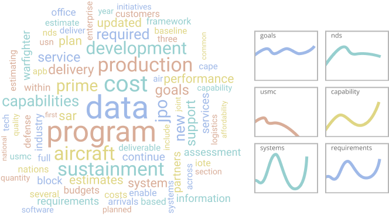

```{r setup, include=FALSE}
knitr::opts_chunk$set(echo = FALSE)
```


# 내가 기대하는 텍스트 분석

1. 연구자들은 텍스트 분석을 통해 **짧은 시간에 많은 양의 기존 문헌을 탐색**하여 **연구와 관련된 내용을 추출**할 수 있을 것이다.
2. 대통령 연설문 텍스트 분석을 통해 역대 **대통령의 중심가치를 파악**할 수 있을 것이다.연설문에 나타난 **단어의 빈도를 분석**하고 **언어 네트워크 분석**을 통해 역대 대통령들의 중심가치 변화와 흐름을 분석할 수 있을 것이다.

<br>

```{r network, echo=FALSE, out.width = "55%", fig.align='center'}

```